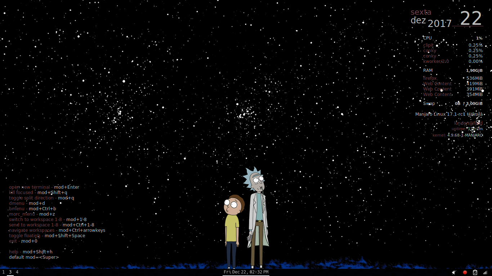
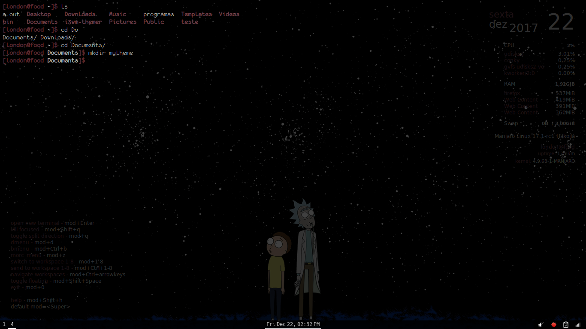

# Theme Manjaro i3wm
Configurações de estilo do meu Manjaro i3wm

# Olá :) 
Aqui disponibilizo meus arquivos de configuração do Manjaro i3wm.

- Para a barra estou utilizando o programa Polybar: https://github.com/jaagr/polybar/wiki 
A barra que utilizei foi estilizada em base nas barras do https://github.com/unix121/i3wm-themer, com apenas alterações de cores e fontes :)
Apenas rodando a barra exemplo, vc obtem o arquivo de configuração do polybar, então vc substutui ele pelo config da barra que você deseja, e roda o comando com o nome da barra. Colocando um comando no arquivo config do i3 (na wiki do polybar eles explicam certinho) vc deixa a barra permanente e remove a barra padrão. 

- Para background estou usando o "feh", adicionando "exec_always feh --bg-scale ~/Paste/archive.png" no arquivo config da pasta ~/.i3
- Para mudar as cores do terminal é só alterar arquivo ~/.extend.Xresources, trocando as cores em hexadecimal. 
- Para mudar as cores do conky é só alterar os arquivos conky_maia para a caixa de texto superior direita, e conky1.10_shortcuts_maia para a caixa inferior esquerda
- Para mudar as cores do dmenu (mod+d) eu editei o arquivo .i3/config na seguinte parte: # start program launcher
bindsym $mod+d exec "dmenu_run -nf '#A9A9A9' -nb '#000000' -sb '#000000' -sf '#E9B2A7' -fn 'FontAwesome-13' -p 'Vai Monstro'"
Essas são minhas configurações, mas vocês pode colocar a cor que quiser, a fonte que quiser e o texto que quiser qua apareça para busca :) 

Nos arquivos que disponibilizei para exemplo: 
- ~/.config/polybar/config = configpolybar
- ~/.i3/config = configi3
- ~/.extend.Xresources = .extend.Xresources
- /usr/share/conky/conky_maia = conky_maia
- /usr/share/conky/conky1.10_shortcuts_maia = conky1.10_shortcuts_maia 

